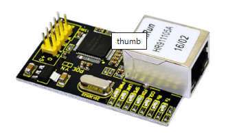
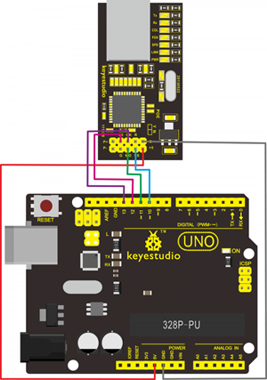
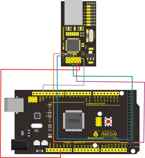

# KS0148 keyestudio W5100



## 1. Introduction

W5100 is a multi-purpose single internet interface chip, integrated 10/100 ethernet controller inside,and applied to embedded system which is high integration, high stability, high performance and low cost.

It can be connected to Internet without operating system and compatible with IEEE802.3 10BASE-T and 802.3u 100BASE-TX.

It contains TCP/IP protocol stack that is full-hardware and verified by market for years, Ethernet medium transport layer and physical layer.

You don’t need to consider the control of Ethernet, and just need simple program of ports.

## 2. Specification

- Various interface: Direct Bus, Indirect Bus and SPI Bus

- Supporting TCP/IP protocol stack of hardware, TCP,UDP,ICMP,IGMP,IPv4,ARP
- Up to 4 independent ports
- Integrating 16KBYTE transmit-receive cache
- Outputting multiple indicating information,including RX,TX,Full/Duplex,Colision,Link,Speed
- Supporting automatic conversion of polarity
- Coming with Internet access, dual row of 2*14 2.0mm pins

## 3. Connection Diagram





## 4.  Sample Code

**Library files and code download:**   [Resources](./Resources.7z)

```
#include <SPI.h>
#include <Ethernet.h>
// Enter a MAC address and IP address for your controller below.
// The IP address will be dependent on your local network:
byte mac[] = {0xDE, 0xAD, 0xBE, 0xEF, 0xFE, 0xED };
IPAddress ip(192,168,1,177);//modifying according your own IP
// Initialize the Ethernet server library
// with the IP address and port you want to use
// (port 80 is default for HTTP):
EthernetServer server(80);

void setup() 
{
    // Open serial communications and wait for port to open:
    Serial.begin(9600);
    while (!Serial) 
    {
    	; // wait for serial port to connect. Needed for Leonardo only
    }
    // start the Ethernet connection and the server:
    Ethernet.begin(mac, ip);
    server.begin();
    Serial.print("server is at ");
    Serial.println(Ethernet.localIP());
}

void loop() 
{
    // listen for incoming clients
    EthernetClient client = server.available();
    if (client) 
    {
        Serial.println("new client");
        // an http request ends with a blank line
        boolean currentLineIsBlank = true;
        while (client.connected()) 
        {
            if (client.available()) 
            {
                char c = client.read();
                Serial.write(c);
                // if you've gotten to the end of the line (received a newline
                // character) and the line is blank, the http request has ended,
                // so you can send a reply
                if (c == '\n' && currentLineIsBlank) 
                {
                    // send a standard http response header
                    client.println("HTTP/1.1 200 OK");
                    client.println("Content-Type: text/html");
                    client.println("Connection: close"); // the connection will be closed after completion
                    //of the response
                    client.println("Refresh: 5"); // refresh the page automatically every 5 sec
                    client.println();
                    client.println("<!DOCTYPE HTML>");
                    client.println("<html>");
                    // output the value of each analog input pin
                    for (int analogChannel = 0; analogChannel < 6; analogChannel++) 
                    {
                        int sensorReading = analogRead(analogChannel);
                        client.print("analog input ");
                        client.print(analogChannel);
                        client.print(" is ");
                        client.print(sensorReading);
                        client.println("<br />");
                    }
                    client.println("</html>");
                    break;
                }
                if (c == '\n') 
                {
                    // you're starting a new line
                    currentLineIsBlank = true;
                }
                else if (c != '\r') 
                {
                    // you've gotten a character on the current line
                    currentLineIsBlank = false;
                }
            }
        }
        // give the web browser time to receive the data
        delay(1);
        // close the connection:
        client.stop();
        Serial.println("client disonnected");
    }
}
```

## 5. Result

After uploading program, you can input you own IP(matching with codes)on browser, and then press the “ENTER”key, showing the result(sometime you need to restart control board).